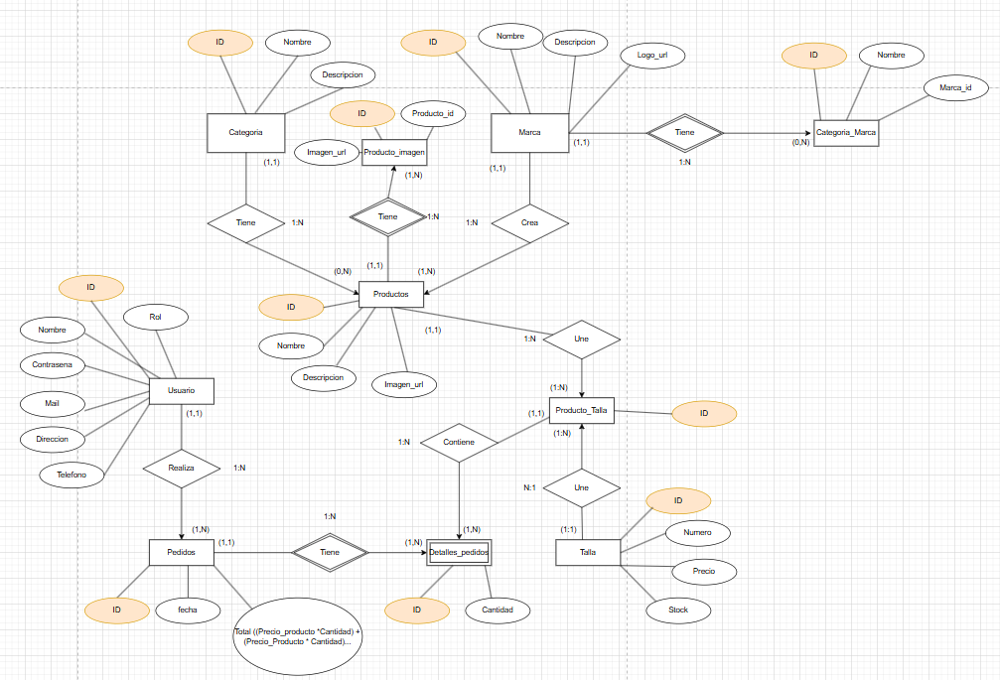
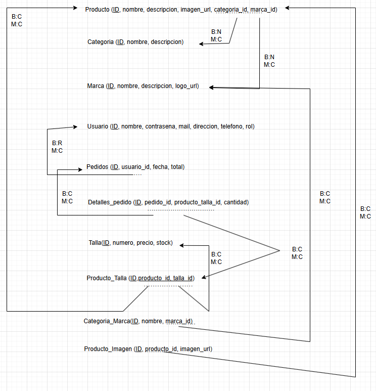

# 📘 Manual Técnico de SapeStore

**Autor:** Ismael Fernández Archilla  

---

## Índice

1. [Introducción](#1-introducción)  
2. [Base de Datos](#2-base-de-datos)  
3. [Estructura de Ficheros](#3-estructura-de-ficheros)  
4. [Aplicaciones Utilizadas](#4-aplicaciones-utilizadas)  
5. [Conclusión](#5-conclusión)

---

## 1. Introducción

Este manual técnico describe la arquitectura y funcionamiento interno del proyecto **SapeStore**, una tienda online de ropa y calzado. Aquí se detallan la estructura de la base de datos, la organización de los archivos, y las herramientas empleadas durante el desarrollo.

---

## 2. Base de Datos

La base de datos está diseñada para almacenar de manera eficiente información sobre:

- Usuarios  
- Pedidos  
- Productos 
- Tallas 
- Marcas  
- Imágenes de productos  
- Categorías y subcategorías  

Se añadieron las tablas `producto_imagen` y `categoria_marca` para mejorar la visualización de productos y una mejor organización por categorías, permitiendo búsquedas más precisas (por ejemplo, filtrar zapatillas por tipo: TN, Dunks, Jordan...).

### Tablas principales

- **Producto**: datos en comun del producto sin contar tallas, precio...
- **Pedidos**: almacena datos del cliente, fecha del pedido y el total.
- **Detalles_Pedido**: almacena los productos del pedido, junto con la talla y el precio individual.
- **Talla**: contiene información de stock, precio y talla.
- **Producto_Talla**: relación entre productos y tallas disponibles.
- **Categoria**: categoria de un producto (zapatillas, camisetas...)

> ⚠️ Aunque la tabla `producto_talla` podría usar una clave compuesta (`producto_id + talla_id`), se añadió una ID propia para permitir funcionalidades futuras como ofertas específicas.

### Diagramas

- 
- 

---

## 3. Estructura de Ficheros

La estructura está pensada para facilitar la exposición del proyecto en plataformas como GitHub. No representa la estructura final de un despliegue en servidor real.

### Estructura general del proyecto

```
├── database/ 
│ ├── db.sql 
│ └── update.sql 
├── docker/ 
│ └── docker-compose.yml 
├── fotosmanuales/ 
├── pagina/ 
│ ├── admin/ 
│ ├── css/ 
│ ├── js/ 
│ ├── partes/ 
│ └── index.php y otras vistas 
├── README.md
├── manual_usuario.md
├── manual_tecnicomd
```

### Descripción de carpetas y archivos

#### 📁 `database/`

Contiene los scripts SQL para crear y actualizar la base de datos:

- `db.sql`: estructura inicial.
- `update.sql`: cambios añadidos tras pruebas en la web.

#### 📁 `docker/`

- `docker-compose.yml`: configuración para despliegue rápido con contenedores Docker.

#### 📁 `fotosmanuales/`

Almacena imágenes usadas en los manuales técnico y de usuario.

#### 📁 `manual_usuario/` y `manual_tecnico/`

Documentación separada para usuarios finales y para desarrolladores.

#### 📁 `pagina/`

Directorio principal de la interfaz web y su lógica.

- **`admin/`**:  
  Archivos para la gestión del sitio:  
  - `admin.php`: panel de administración  
  - `insert.php`, `delete.php`, `update.php`: gestión de productos  
  - `toggle_popular.php`, `toggle_status.php`: activación rápida de estados  
  - Archivos JSON: `popular_products.json`, `fast_delivery_products.json`

- **`css/` y `js/`**:  
  Archivos de estilos (Bootstrap) y scripts.

- **`partes/`**:  
  Componentes reutilizables como `navbar.php`, `footer.php`.

- **Archivos raíz**:  
  Vistas principales del sitio y dos archivos CSS (uno para administración y otro para el usuario).  
  > ⚠️ *Nota:* El CSS no está en una subcarpeta porque me da fallo al cargar las imagenes si lo hago.

---

## 4. Aplicaciones Utilizadas

| Aplicación             | Uso principal                                                                |
|------------------------|------------------------------------------------------------------------------|
| **Draw.io**            | Crear el diagrama entidad-relación y grafo de la base de datos               |
| **XAMPP**              | Servidor local para pruebas                             |
| **phpMyAdmin**         | Administración visual de la base de datos                                    |
| **Visual Studio Code** | Editor de código fuente                                                      |
| **Canva**              | Edición de imágenes, creación de logos y fondos transparentes para productos |

---

## 5. Conclusión

Este manual técnico tiene como objetivo ofrecer una visión clara y detallada del funcionamiento interno de **SapeStore**. Desde la estructura de la base de datos hasta la organización de los archivos y herramientas utilizadas.

---

**Ismael Fernández Archilla**  
_Desarrollador Web & Creador de SapeStore_