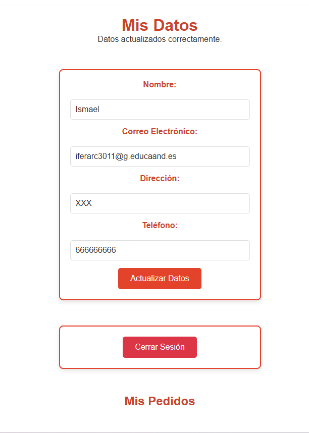
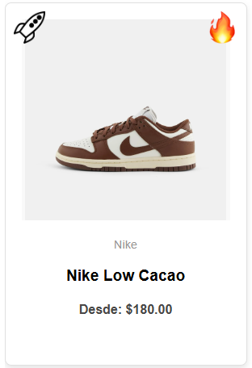
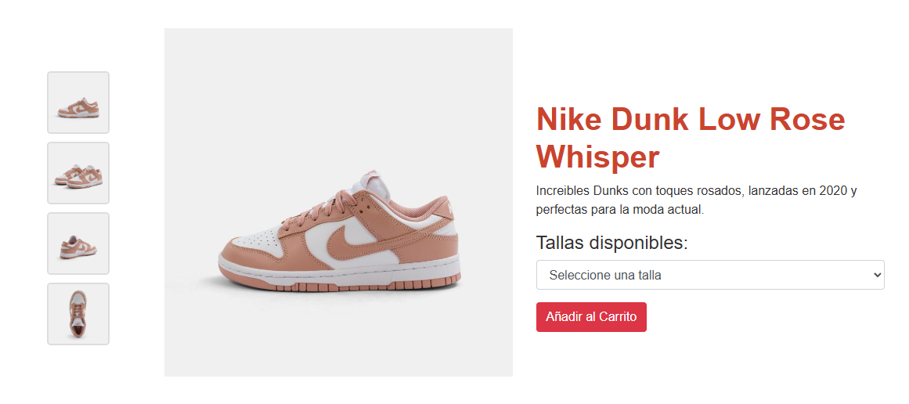
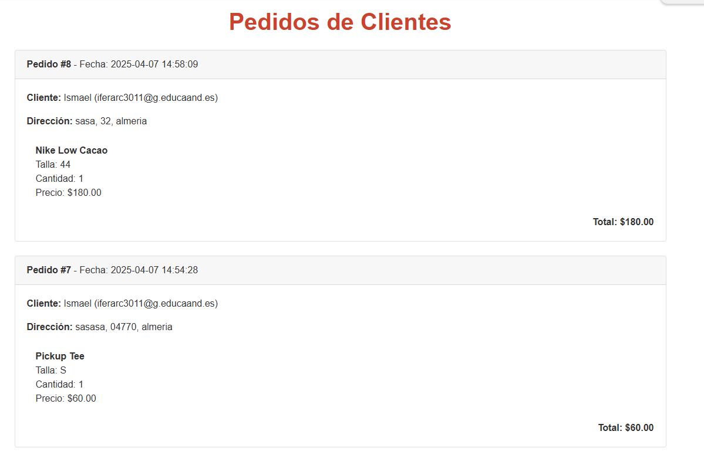
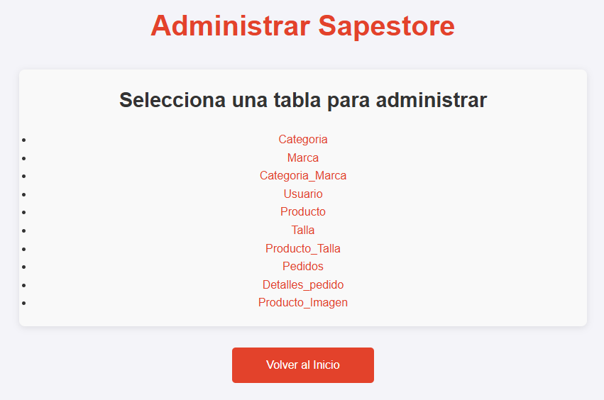
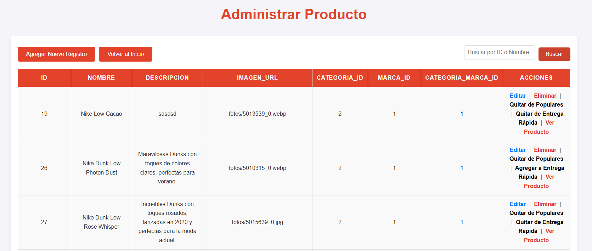
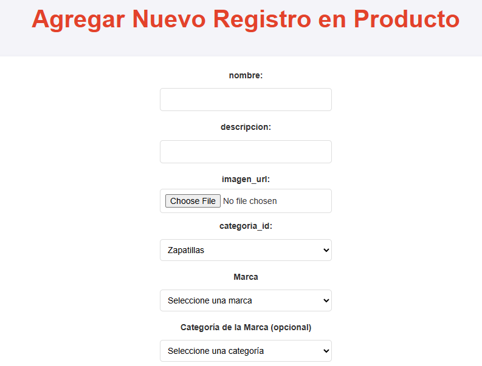

# Manual de usuario

_Ismael Fernández Archilla_


---

## Índice

- Proceso de instalación  
  - Prerrequisitos  
  - Instalación  
- Opciones de la Web  
  - Cliente  
  - Administrador  
- Conclusión  

---

## Proceso de instalación

### Prerrequisitos

1. **Instalar Docker y Docker Compose**  
   - Descarga Docker Desktop desde:  
     https://www.docker.com/products/docker-desktop  
   - Asegúrate de que incluya Docker Compose (Docker Desktop lo suele incluir así que no debería haber problemas).

2. **Estructura de las carpetas**  
   Asegúrate de que la estructura del proyecto sea la siguiente (de lo contrario `docker-compose` no podrá desplegarlo correctamente):

```
Sapestore/
├── docker/
│   └── docker-compose.yml
├── Pagina/
│   ├── index.php
│   ├── config.php
│   └── ... (resto de archivos y carpetas)
```

### Instalación

1. **Abrir Terminal**  
- Navega hasta el directorio donde se encuentra el archivo `docker-compose.yml`:
  ```bash
  cd c:/xampp/htdocs/Sapestore/docker
  ```

2. **Iniciar los contenedores**  
- Ejecuta:
  ```bash
  docker-compose up -d
  ```
- Este comando hará lo siguiente:
  1. Crear un contenedor para la web con PHP y Apache.  
  2. Crear un contenedor para la base de datos MySQL.  
  3. Montar la carpeta `Pagina` en el contenedor web en `/var/www/html`.

3. **Verificar el estado de los contenedores**  
- Ejecuta:
  ```bash
  docker ps
  ```
  Deberían aparecer `sapestore_web` y `sapestore_db`.

4. **Configurar la base de datos**  
- Asegúrate de que el archivo `config.php` de la carpeta `Pagina` tenga las credenciales correctas para conectarse al contenedor.

5. **Acceder a la web**  
- Abre un navegador y accede a:  
  [http://localhost:8080](http://localhost:8080)

> **A tener en cuenta:**  
> Los datos de la base de datos se guardan en el volumen `db_data`, por lo que **no se perderán al detener los contenedores**.

---

## Opciones de la Web

### Cliente

Al iniciar la web se muestra la siguiente interfaz:


- La imagen principal cambia cada 5 segundos entre 3 diferentes.  
- Al hacer click en ellas, te lleva a páginas distintas.  
- Debajo hay un carrusel de marcas que va pasando de 4 en 4, administrado desde el panel de admin.

En la navbar hay varias opciones:
- El menú se despliega al hacer hover para una navegación rápida.  
- Una lupa que abre un buscador de productos y marcas.  
- El logo que redirige al `index.php`.  
- El carrito de compras con productos añadidos, tallas y precio total.  
- Opción de inicio de sesión.


---

Si el usuario está logueado:
- Al hacer click en su perfil puede ver y actualizar sus datos y pedidos realizados.



---

Al hacer click en una marca o desde el menú de navegación:
- Se muestra el nombre de la marca, descripción y sus productos.  
- Es la misma vista que para categorías (StreetWear, etc.).

Las cartas de producto incluyen:
- Marca, nombre, precio más bajo (varía según la talla).  
- **Símbolos**:  
- 🚀 Entrega rápida (producto en stock).  
- 🔥 Producto popular (alta demanda).



---

Al hacer click en un producto:
- Vista con imágenes a la izquierda, descripción, tallas y precios.  
- Solo se puede añadir al carrito si estás logueado.  
- Debajo se muestran productos relacionados.



---

Al proceder con el pago:
- Se muestra un resumen del pedido y se solicitan los datos de envío.  
- Se pregunta si se ha realizado el pago:
- Si se dice que no: aparece un mensaje de error.  
- Si se dice que sí: redirige a la página de confirmación.


---

Después del pedido:
- En la sección de usuario aparece “Mis pedidos” con el historial de compras.

---

### Administrador

Los usuarios nuevos se crean con rol de **cliente**.  
Para que un usuario sea **admin**, debe cambiarse desde la base de datos.

Los administradores tienen una interfaz diferente:
- Al hacer click en el carrito, pueden ver **todos los pedidos** de todos los usuarios, junto con nombre, correo, dirección y fecha.



En la navbar aparece un nuevo **ícono de configuración**.


Desde este ícono se accede a la gestión de base de datos mediante una interfaz gráfica:



- Agregar categorías, marcas, productos.  
- Dar de baja usuarios o eliminar productos.  

Hay tablas que **no se deben modificar directamente**, como:
- `Producto_Talla`, `Pedidos`, `Producto_Imagen`, etc.

---

Si se accede a la tabla de productos, se muestra una lista editable:
- Buscar por ID o nombre.  
- Editar, eliminar o agregar registros.  
- Marcar productos como populares o de entrega rápida.



Al agregar un nuevo producto, se genera un formulario dinámico según la tabla:



- Para productos, se pueden agregar múltiples tallas e imágenes.  
- Cada nueva talla o imagen genera automáticamente un nuevo campo.  
- El sistema evita insertar tallas vacías.

También se puede especificar a qué categoría/marca pertenece el producto (opcional).

Para otras tablas, el formulario es más simple.

---

> ⚠️ **Recomendación para imágenes**:  
> Aunque se pueden poner muchos tipos de imagenes, es mejor que sean todas de las mismas dimensiones y el mismo fondo, para una correcta visualizacion de la web.

---

## Conclusión

Este manual está diseñado para facilitar:
- La instalación del entorno.  
- El uso correcto del sistema, especialmente en la parte de administración.

La web es **responsive**, por lo que funciona correctamente desde **móviles, tablets, etc.**

---

**¡Gracias por utilizar Sapestore!**
